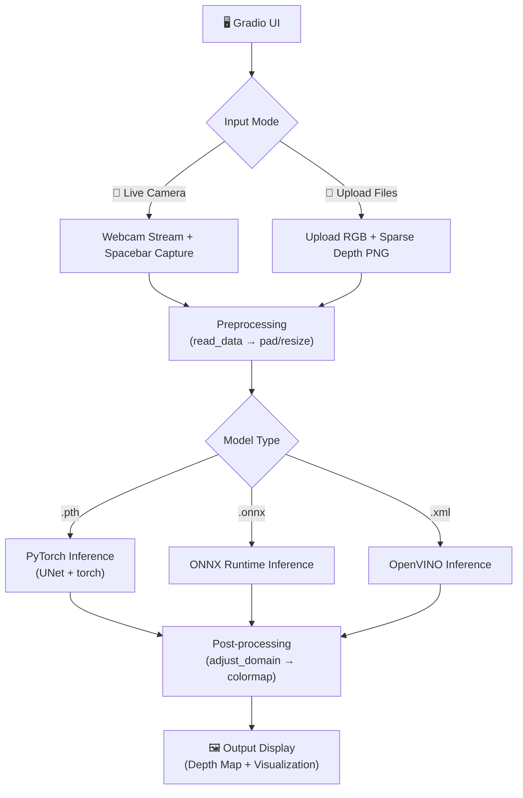

# Gradio Depth Completion Inference Tool

Tạo giao diện Gradio cho dự án G2-MonoDepth Depth Completion, hỗ trợ chọn model, chụp ảnh trực tiếp hoặc upload dữ liệu, và hiển thị kết quả depth map.

## Tổng quan kiến trúc



## User Review Required

> [!IMPORTANT]
> **Camera + LiDAR live capture**: Bạn đề cập "hình ảnh kết hợp với data từ lidar được chiếu trực tiếp lên hình RGB". Trong Gradio, tôi sẽ hỗ trợ **webcam capture** cho ảnh RGB. Tuy nhiên, dữ liệu LiDAR sparse depth cần được **upload riêng** (dạng 16-bit PNG) vì Gradio không thể trực tiếp nhận dữ liệu từ cảm biến LiDAR. Nếu bạn có pipeline riêng tạo sparse depth từ LiDAR, bạn có thể upload file đó.

> [!IMPORTANT]
> **OpenVINO model**: Trong thư mục `checkpoints/models/` có cả file `openvino_model.xml/.bin`. Tôi sẽ hỗ trợ luôn cả 3 loại model (PyTorch `.pth`, ONNX `.onnx`, OpenVINO `.xml`). Bạn có muốn bỏ OpenVINO không?

## Open Questions

> [!NOTE]
> **Spacebar capture**: Gradio web UI không hỗ trợ native keyboard shortcut "spacebar" để chụp ảnh từ webcam. Thay vào đó tôi sẽ dùng **nút "📸 Capture"** hoặc **Gradio WebcamInput** component có sẵn nút chụp. Bạn có OK với cách này không?

> [!NOTE]
> **Sparse depth cho live capture**: Khi chụp ảnh trực tiếp bằng webcam, bạn vẫn cần upload file sparse depth (từ LiDAR) riêng. Hoặc nếu muốn test "monocular only" (0% sparse depth), model sẽ nhận input sparse depth = 0. Bạn muốn hỗ trợ cả hai trường hợp?

## Proposed Changes

### [NEW] Gradio App

#### [NEW] [gradio_app.py](file:///d:/GIÁO TRÌNH/KLTN/Depth_Completion/gradio_app.py)

File chính chứa toàn bộ logic Gradio UI và inference engine.

**Cấu trúc chính:**

```python
# 1. Model Manager - Quản lý load/inference cho 3 loại model
class ModelManager:
    def scan_models(model_dir)     # Scan thư mục, phân loại .pth/.onnx/.xml
    def load_model(model_path)     # Load model tùy loại
    def infer(rgb, raw, hole_raw)  # Chạy inference, tự detect loại model

# 2. Data Processing - Tái sử dụng logic từ test_utils.py
    def preprocess(rgb_image, sparse_depth_image)  # Từ PIL Image → tensor
    def postprocess(prediction)                     # Tensor → depth map + colormap

# 3. Gradio UI
    # Tab 1: Upload Mode - Upload RGB + Sparse Depth
    # Tab 2: Camera Mode - Webcam capture RGB + Upload Sparse Depth
    # Model selector dropdown (auto-scan từ checkpoints/models/)
```

**Chi tiết các thành phần UI:**

| Component | Type | Mô tả |
|-----------|------|--------|
| Model Selector | `gr.Dropdown` | Dropdown chọn model, auto-detect `.pth`/`.onnx`/`.xml` |
| Tab "📁 Upload" | `gr.Tab` | Upload RGB image + Sparse Depth image (16-bit PNG) |
| Tab "📸 Camera" | `gr.Tab` | Webcam capture + optional sparse depth upload |
| Run Button | `gr.Button` | Nút "🚀 Run Inference" |
| Output Depth | `gr.Image` | Hiển thị depth map kết quả (grayscale 16-bit) |
| Output Colormap | `gr.Image` | Hiển thị depth map dạng colormap (Turbo/Magma) |
| Inference Time | `gr.Textbox` | Thời gian inference |
| Status | `gr.Textbox` | Trạng thái hiện tại |

**Inference pipeline:**

1. **Input**: RGB image (PIL/np) + Sparse Depth image (16-bit PNG, optional)
2. **Preprocess**: Tái sử dụng `RGBPReader` logic từ [test_utils.py](file:///d:/GIÁO TRÌNH/KLTN/Depth_Completion/test_utils.py)
   - RGB: normalize `/255.0`, transpose to `(C,H,W)`, unsqueeze batch
   - Sparse Depth: normalize `/65535.0`, tạo `hole_raw` mask
   - Pad/Resize tùy loại model (pad 64 cho PyTorch, resize 320×448 cho ONNX)
3. **Inference**: Tùy loại model:
   - **PyTorch** (`.pth`): Load `UNet`, `torch.no_grad()`, pad to 64 multiple
   - **ONNX** (`.onnx`): `onnxruntime.InferenceSession`, resize to 320×448
   - **OpenVINO** (`.xml`): `openvino.Core`, compile + infer
4. **Postprocess**: `adjust_domain()` → grayscale 16-bit → apply colormap (Turbo)

**Thiết kế UI (Dark theme, premium):**

- Sử dụng `gr.Blocks` với theme `gr.themes.Soft(primary_hue="teal")`
- Custom CSS cho dark mode, glassmorphism cards, smooth transitions
- Header gradient với tên project và mô tả
- Side-by-side layout: Input (trái) | Output (phải)
- Animated loading indicator khi inference

## Verification Plan

### Automated Tests
1. Kiểm tra Gradio app khởi động không lỗi:
   ```bash
   python gradio_app.py
   ```
2. Test upload mode với dữ liệu có sẵn trong `Test_Datasets/Private_Real/`:
   - Upload RGB từ `rgb/` folder
   - Upload Sparse Depth từ `raw_1%/` folder
   - Chọn từng loại model và chạy inference
3. Verify output depth map có giá trị hợp lệ (không toàn 0, range đúng)

### Manual Verification
- Kiểm tra UI hiển thị đúng trên browser
- Kiểm tra webcam capture hoạt động
- So sánh output với kết quả từ `test.py` / `test_ONNX.py` gốc
