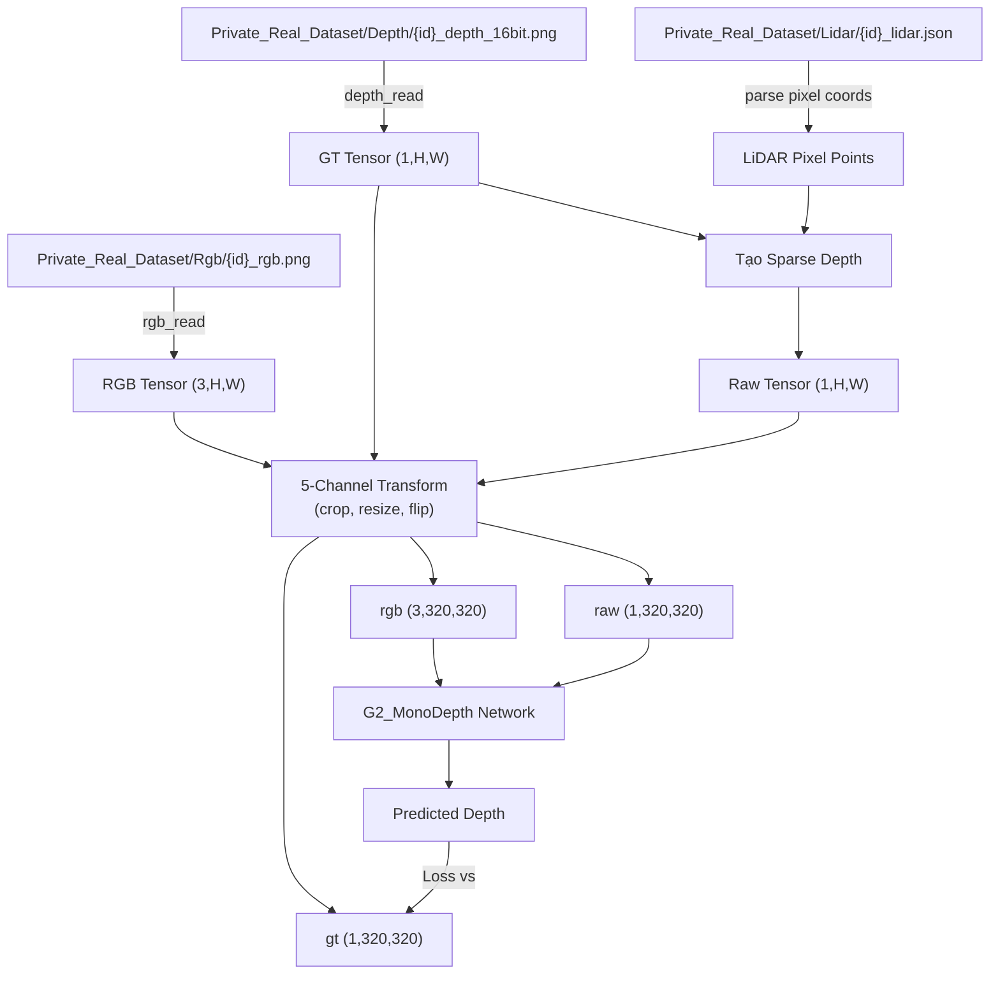

# Walkthrough: Load Private_Real_Dataset để Finetune (Cách B)

## Tổng quan thay đổi

Triển khai Dataset mới để finetune model G2-MonoDepth từ dữ liệu thực tế (`Private_Real_Dataset`), sử dụng tọa độ LiDAR thật từ file JSON thay vì mô phỏng.

## Các file đã thay đổi

### [NEW] [data_tools_real.py](file:///d:/GIÁO TRÌNH/KLTN/Depth_Completion/src/data_tools_real.py)

File mới chứa toàn bộ logic load dữ liệu từ `Private_Real_Dataset`:

| Class / Function | Vai trò |
|---|---|
| `RealResizedCropRGBDR` | RandomResizedCrop cho 5 channels (rgb+gt+raw), theo dõi hole mask cho cả GT và Raw |
| `RealTransformUtils` | Pipeline transform: spatial (crop/resize/flip) → color jitter → depth augment |
| `PrivateRealDataset` | Dataset chính: đọc RGB + depth_16bit + lidar JSON, tạo sparse depth từ tọa độ LiDAR thật |
| `get_real_dataloader()` | Factory function tạo DataLoader + DistributedSampler |

**Cách tạo sparse depth input:**
1. Đọc LiDAR JSON → lấy tọa độ pixel `[px, py]`
2. Tại mỗi tọa độ, lấy giá trị depth từ GT: `sparse[0, py, px] = gt[0, py, px]`
3. Transform cả 5 channels cùng nhau (giữ đồng bộ spatial)
4. Nếu sau crop/resize mất hết điểm LiDAR → fallback sampling 1 dòng từ GT

---

### [MODIFY] [src_main.py](file:///d:/GIÁO TRÌNH/KLTN/Depth_Completion/src/src_main.py)

Thêm conditional dataloader selection trong `G2_MonoDepth.__init__()`:

```diff
+from .data_tools_real import get_real_dataloader
 
-self.loader, self.sampler = get_dataloader(cf.rgbd_dirs, cf.hole_dirs, ...)
+if hasattr(cf, 'dataset_dir') and cf.dataset_dir is not None:
+    self.loader, self.sampler = get_real_dataloader(cf.dataset_dir, ...)
+else:
+    self.loader, self.sampler = get_dataloader(cf.rgbd_dirs, cf.hole_dirs, ...)
```

> [!NOTE]
> `train.py` vẫn hoạt động bình thường vì `Configs` mặc định không có `dataset_dir`.

---

### [MODIFY] [finetune.py](file:///d:/GIÁO TRÌNH/KLTN/Depth_Completion/finetune.py)

render_diffs(file:///d:/GIÁO TRÌNH/KLTN/Depth_Completion/finetune.py)

**Thay đổi chính:**
- `--rgbd_dir` + `--hole_dir` → `--dataset_dir` (mặc định `Private_Real_Dataset`)
- Thêm CLI args: `--lr`, `--epochs`, `--batch_size` để dễ thay đổi khi finetune
- Set `cf.dataset_dir` để trigger real dataloader
- `checkpoint_epoch=1` (lưu mỗi epoch), `feedback_iteration=50` (in loss thường xuyên hơn)

---

## Cách chạy Finetune

```bash
# Mặc định: dùng Private_Real_Dataset, lr=1e-5, 5 epochs
python finetune.py

# Tuỳ chỉnh:
python finetune.py --dataset_dir Private_Real_Dataset \
                   --model_dir checkpoints/models/epoch_100.pth \
                   --save_dir checkpoints_finetune \
                   --lr 1e-5 \
                   --epochs 5 \
                   --batch_size 16
```

> [!TIP]
> **Tips cho finetune dataset nhỏ (460 mẫu):**
> - Learning rate `1e-5` (thấp hơn 5x so với train gốc `5e-5`) để tránh catastrophic forgetting
> - 3-5 epochs là đủ, tránh overfit
> - Giảm batch_size nếu GPU thiếu VRAM
> - Checkpoint được lưu mỗi epoch tại `checkpoints_finetune/models/`

## Data Flow Diagram


